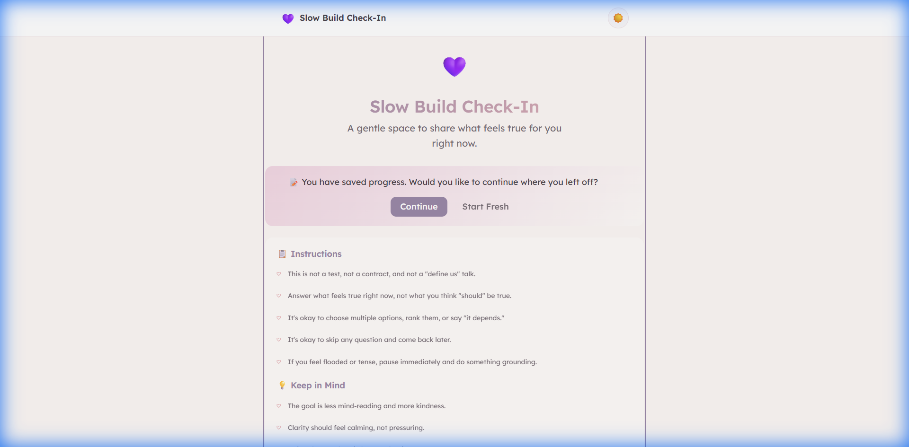
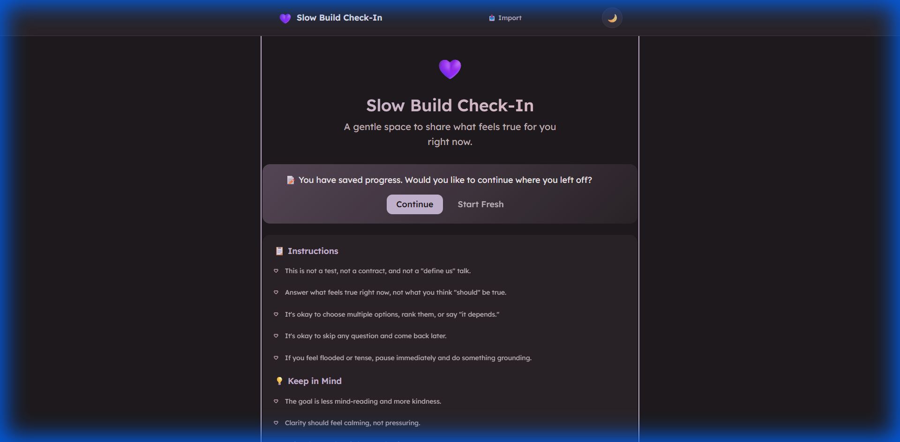
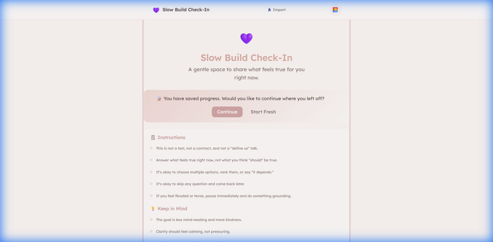
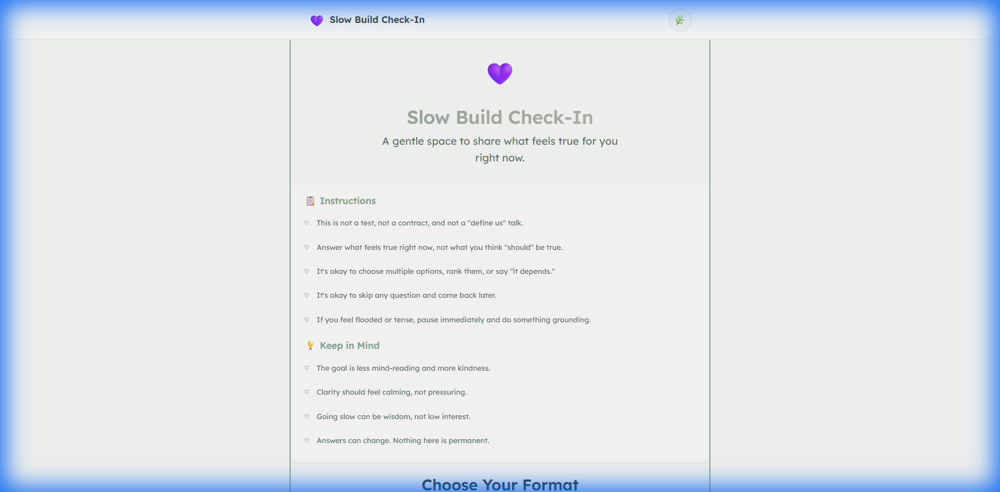
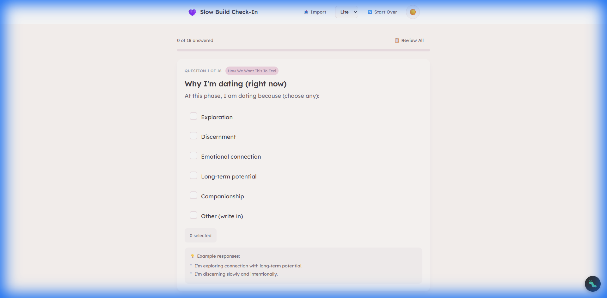
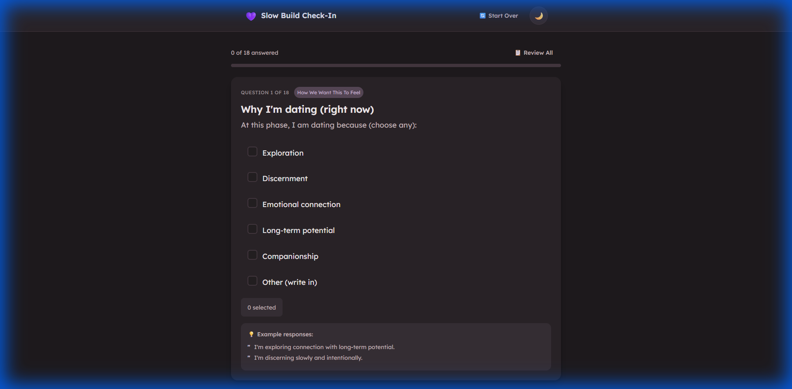
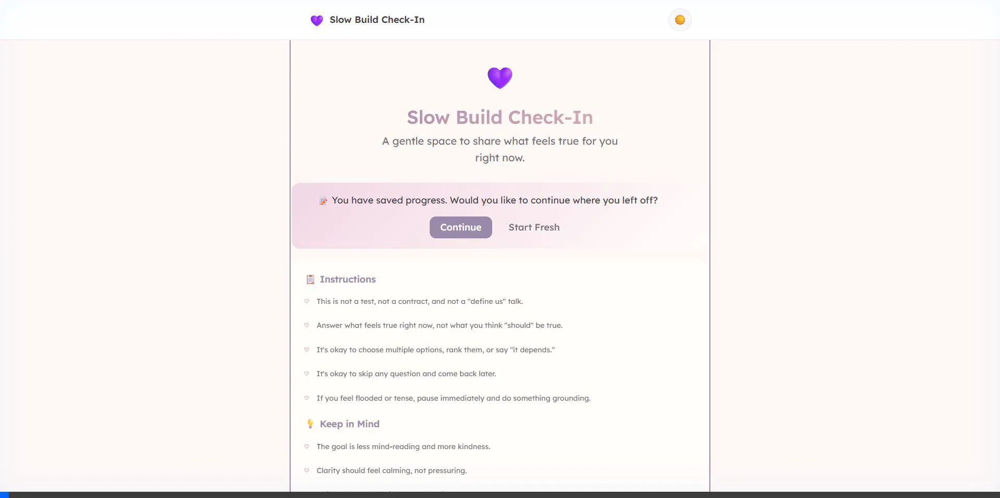
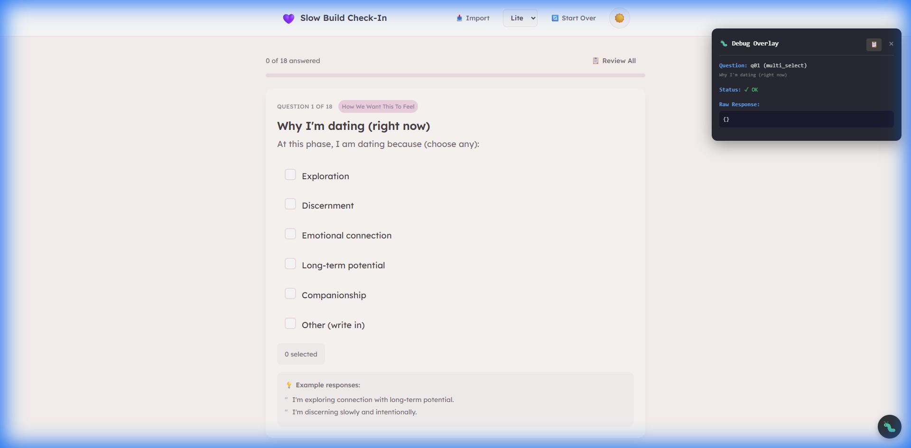

# 💜 Slow Build Check-In

> *A beautiful, intentional check-in tool for early-stage relationships. Designed to feel warm, inviting, and never overwhelming.*



<p align="center">
  
  
  
  
</p>

---

## 🌸 What Is This?

This tool helps couples in the **intentional early dating phase** (3+ dates, mutual interest, slow build) navigate gentle check-ins around:

| Topic | What It Covers |
|-------|----------------|
| **Pacing** | What feels too slow? Too fast? When to revisit clarity? |
| **Communication** | How we stay connected, overwhelm patterns, safety |
| **Affection** | What feels best, approach consent, overwhelm signs |
| **Trust** | Group settings, initiative, feeling chosen without pressure |

### ✨ Design Philosophy

- **Warm & Intentional** — Soft colors, gentle language, no clinical terminology
- **Exciting yet Soft** — Blush-lavender palette that energizes and calms
- **Never Overwhelming** — One question at a time, skip freely, smooth transitions
- **Accessible** — Dyslexia-friendly Lexend font, 18px base, WCAG AA contrast

---

## 🚀 Quick Start

### Standalone (No Server Required)

```bash
# Just open in any browser
open index.html
```

### Local Development Server

```bash
# Python
python -m http.server 8080

# Node.js
npx serve . -l 8080

# Then visit http://localhost:8080
```

---

## 🎨 Four Beautiful Themes

Click the theme icon in the nav to cycle through themes with a smooth bloom transition effect.

| Theme | Icon | Vibe | Default |
|-------|------|------|---------|
| **Light** | ☀️ | Soft blush-lavender, warm and inviting | ✓ |
| **Dark** | 🌙 | Midnight rose, cozy nighttime comfort | |
| **Warm** | 🌅 | Peachy blush, romantic and nurturing | |
| **Nature** | 🌿 | Soft sage, grounded and peaceful | |

<details>
<summary>📸 Theme Screenshots</summary>

| Light Theme | Dark Theme |
|-------------|------------|
|  |  |

| Warm Theme | Nature Theme |
|------------|--------------|
|  |  |

**Questionnaire View:**

| Light Theme | Dark Theme |
|-------------|------------|
|  |  |

**Theme Transition Animation:**



</details>

---

## ✨ Features

### 📋 Two Modes

- **Lite Mode**: 18 core questions (~45 minutes)
- **Full Mode**: 38 questions across 10 sections
- **Switch anytime**: Dropdown in nav bar to switch Lite ↔ Full (preserves all answers)

### ⏭ Skip & Return

- Skip any question with one click
- Badge shows how many are skipped
- Jump to skipped questions anytime
- **Yellow progress bar segments** indicate skipped questions

### 📊 Review Mode

- See all questions at a glance
- Visual indicators: ✓ answered, ⏭ skipped, ○ unanswered
- Click any card to jump back and edit

### 💾 Auto-Save & Long-Term Persistence

- Progress saved to localStorage automatically
- Resume where you left off after closing browser
- **Persists for weeks** until you click "Start Over" or clear browser data
- Works across Chrome, Firefox, Safari, Edge

### 📂 Advanced Import System

Two import modes (click **📥 Import** in nav or welcome screen):

- **Continue Questionnaire**: Resume from saved JSON file
- **Generate AI Prompt**: Create reflection prompts from any saved results
  - Upload one file for individual reflection
  - Upload two files for couple's joint prompt
- Smart parsing handles both JSON and TXT export formats
- Questions are flagged for review after import

### 📤 Export Options

- **Text file**: Beautifully formatted for reading/sharing
- **JSON file**: Machine-readable, can be re-imported later
- **Clipboard**: Quick copy for pasting elsewhere
- **View Raw**: Mobile-friendly fallback for copy operations

### 🤖 AI Reflection Prompts

**Four specialized prompt types:**

| Type | Description |
|------|-------------|
| Individual Lite | Personal insights from 18 core questions |
| Individual Full | Comprehensive relational blueprint from all 38 questions |
| Couple's Lite | How to show up for each other (both completed Lite) |
| Couple's Full | Complete relationship blueprint with conflict protocols |

**Two workflows:**

1. **During Questionnaire**: Copy prompts from the Complete view
2. **From Saved Files**: Import any exported results via the Import modal

### 💑 Couple's Reflection Workflow

1. Each partner completes the questionnaire separately
2. **Copy My Results**: Each person copies their formatted responses
3. **Copy Couple's Prompt**: Get the AI template that accepts both responses
4. Paste both sets of results into the prompt for joint AI reflection

### 🚀 Upgrade to Full Mode

- Shown after completing Lite mode
- Click **📈 Continue to Full Mode** to add 20 more questions
- All existing answers are preserved

### 🔄 Start Over

- Clears ALL answered questions and local cache
- Shows clear warning before permanently deleting responses

---

## 📝 The Questions

### Lite Mode (18 Core Questions)

<details>
<summary><strong>Section 1: How We Want This To Feel</strong></summary>

1. **Why I'm dating (right now)** — What brings you to dating at this phase?
2. **What feels comfortable right now** — Slow, warm, playful, clear?
3. **Too slow (for me)** — What pace would feel neglected?
4. **Too fast (for me)** — What pace would feel pressured?
5. **Review point for clarity** — When should we revisit expectations?

</details>

<details>
<summary><strong>Section 2: How We Stay Connected</strong></summary>

1. **Check-in cadence** — How often and in what format?
2. **Overwhelm pattern** — What do I do when unsure? How to respond?
3. **What safety means** — When do I feel safe with you?

</details>

<details>
<summary><strong>Section 3: How We Care For Each Other</strong></summary>

1. **Support when stressed** — What helps me most from you?
2. **How to share the past** — Transparency level for past relationships

</details>

<details>
<summary><strong>Section 4: Affection That Feels Good</strong></summary>

1. **Affection that feels best right now** — What's comfortable for my nervous system?
2. **Approach for a kiss** — Best way to initiate, what words land well
3. **Overwhelm signs and best response** — How to know if I'm overwhelmed

</details>

<details>
<summary><strong>Section 5: In Public and In Private</strong></summary>

1. **Group settings preference** — How we act around friends
2. **Initiative and leadership** — Who plans/initiates what?
3. **Chosen without pressure** — What helps me feel wanted, not pushed?

</details>

<details>
<summary><strong>Section 6: What We're Building</strong></summary>

1. **A fear I'm willing to name** — A dating fear I'm ready to share
2. **How we treat this connection** — One sentence to describe our approach

</details>

---

### Full Mode (20 Additional Questions)

<details>
<summary><strong>Section 7: What We Believe and Value</strong></summary>

1. **Top values (choose up to 5)** — What matters most in a relationship?
2. **Faith and church alignment** — How does faith show up for us?
3. **Physical boundaries and standards** — How explicit should we be?
4. **What "defining the relationship" means to me** — Exclusivity, labels, routines?
5. **Future talk pacing** — How much marriage/kids/life talk feels good?
6. **Roles and leadership expectations** — Shared, complementary, or one leads?

</details>

<details>
<summary><strong>Section 8: Repair and Reconnection</strong></summary>

1. **My conflict style under stress** — How I react when hurt
2. **What helps me de-escalate** — Fastest way to calm down
3. **Apology and repair language** — What makes an apology meaningful?
4. **Not-okay conflict behaviors** — Boundaries for disagreements
5. **Heavy topics boundaries** — Pace for discussing trauma/past
6. **Preferred repair ritual** — How we reconnect after hard moments

</details>

<details>
<summary><strong>Section 9: Rhythm and Real Life</strong></summary>

1. **Ideal cadence for seeing each other** — How often right now?
2. **Communication channel preferences** — Text, calls, in-person?
3. **Privacy and sharing boundaries** — Friends, social media?
4. **Pace of integration** — Introducing friends/family when?

</details>

<details>
<summary><strong>Section 10: Feeling Secure Together</strong></summary>

1. **Jealousy triggers (if any)** — What triggers insecurity?
2. **What reassurance works best** — How to help when I'm anxious
3. **Exclusivity boundary preference** — Open, focused, or exclusive?
4. **Boundaries with other connections** — Dating apps, friendships, etc.

</details>

---

## 📁 Project Structure

```
dating_questionnaire/
├── index.html                  # Main entry point
├── README.md                   # This file
│
├── data/
│   ├── questions.json          # All 38 questions with schema
│   └── prompts.json            # AI reflection prompts
│
├── css/
│   ├── variables.css           # Design tokens
│   ├── base.css                # Reset, typography, fonts
│   ├── components.css          # Buttons, cards, inputs
│   ├── animations.css          # Transitions, micro-animations
│   ├── responsive.css          # Mobile/tablet/desktop
│   ├── app.css                 # Application layouts
│   └── themes/
│       ├── light.css           # Soft blush-lavender (default)
│       ├── dark.css            # Midnight rose
│       ├── warm.css            # Peachy blush
│       └── nature.css          # Sage with rose warmth
│
├── js/
│   ├── app.js                  # Main entry, initialization
│   ├── data-loader.js          # JSON loading
│   ├── storage-manager.js      # LocalStorage persistence
│   ├── theme-manager.js        # Theme switching + transitions
│   ├── question-renderer.js    # Question type rendering
│   ├── questionnaire-engine.js # Navigation, state machine
│   ├── export-manager.js       # Export functionality
│   ├── import-manager.js       # File import and parsing
│   └── debug-overlay.js        # Debug mode (?debug=true)
│
└── assets/
    └── images/                 # Screenshots and demos
```

---

## ⌨️ Keyboard Shortcuts

| Key | Action |
|-----|--------|
| `→` or `Enter` | Next question |
| `←` | Previous question |
| `S` | Skip current question |
| `R` | Open review mode |

---

## 🐛 Debug Mode

For developers and troubleshooting. Append `?debug=true` to the URL to enable debug mode.

**How to use:**

1. Navigate to `http://localhost:8080/?debug=true` (or add `?debug=true` to any URL)
2. A **🐛 bug button** appears in the **bottom-right corner** of the screen
3. Click the button or press `Ctrl+D` to show/hide the debug overlay

**Debug overlay features:**

| Feature | Description |
|---------|-------------|
| **Question Info** | Shows current question ID, type, and title |
| **Raw Response JSON** | Displays the exact data structure being saved |
| **Field Status** | For compound questions, shows ✓/✗ for each field |
| **Import Warnings** | Highlights questions that need review after import |
| **Copy Button** | 📋 Copies response JSON to clipboard |

**Keyboard shortcut:** `Ctrl+D` toggles the overlay visibility at any time (when debug mode is enabled).

<details>
<summary>📸 Debug Overlay Screenshot</summary>



</details>

---

## 🔧 Customization

### Adding Your Own Questions

Edit `data/questions.json`. The system supports **4 question types**:

<details>
<summary><strong>📌 Single Select (Radio Buttons)</strong></summary>

```json
{
  "id": "q10",
  "section_id": "s3",
  "order": 10,
  "title": "How to share the past",
  "prompt": "When we talk about past relationships, I prefer:",
  "type": "single_select",
  "options": [
    { "value": "full_transparency", "label": "Full transparency" },
    { "value": "high_level", "label": "High-level summaries" },
    { "value": "only_relevant", "label": "Only if relevant to the present" },
    { "value": "slow_over_time", "label": "Slowly over time as trust builds" }
  ],
  "answer_schema": { "selected_value": "", "notes": "" },
  "tags": { "included_in_manifests": ["lite", "full"] }
}
```

</details>

<details>
<summary><strong>☑️ Multi Select (Checkboxes)</strong></summary>

```json
{
  "id": "q01",
  "section_id": "s1", 
  "order": 1,
  "title": "Why I'm dating (right now)",
  "prompt": "At this phase, I am dating because (choose any):",
  "type": "multi_select",
  "options": [
    { "value": "exploration", "label": "Exploration" },
    { "value": "discernment", "label": "Discernment" },
    { "value": "emotional_connection", "label": "Emotional connection" },
    { "value": "long_term_potential", "label": "Long-term potential" },
    { "value": "other", "label": "Other (write in)" }
  ],
  "answer_schema": { "selected_values": [], "other_text": "" },
  "tags": { "included_in_manifests": ["lite", "full"] }
}
```

</details>

<details>
<summary><strong>📝 Free Text (Open-ended)</strong></summary>

```json
{
  "id": "q03",
  "section_id": "s1",
  "order": 3,
  "title": "Too slow (for me)",
  "prompt": "A pace that would feel too slow for me right now would look like:",
  "type": "free_text",
  "answer_schema": { "text": "" },
  "examples": [
    "No intentional plans.",
    "Avoiding clarity for weeks.",
    "Feeling like an option."
  ],
  "tags": { "included_in_manifests": ["lite", "full"] }
}
```

</details>

<details>
<summary><strong>🔗 Compound (Multi-field Questions)</strong></summary>

```json
{
  "id": "q06",
  "section_id": "s2",
  "order": 6,
  "title": "Check-in cadence",
  "prompt": "Ideal cadence and format for intentional check-ins:",
  "type": "compound",
  "fields": [
    {
      "key": "frequency",
      "label": "How often?",
      "type": "single_select",
      "options": [
        { "value": "weekly_10", "label": "Weekly (10 minutes)" },
        { "value": "biweekly_20", "label": "Bi-weekly (15–20 minutes)" },
        { "value": "as_needed", "label": "As needed / organic" }
      ]
    },
    {
      "key": "format",
      "label": "Preferred format",
      "type": "single_select",
      "options": [
        { "value": "in_person", "label": "In person" },
        { "value": "call", "label": "Phone/voice" },
        { "value": "walk_and_talk", "label": "Walk/drive + talk" }
      ]
    },
    {
      "key": "notes",
      "label": "Notes (optional)",
      "type": "free_text"
    }
  ],
  "answer_schema": { "frequency": "", "format": "", "notes": "" },
  "tags": { "included_in_manifests": ["lite", "full"] }
}
```

</details>

### Adding to Lite vs Full Mode

In `questions.json`, each question has a `tags.included_in_manifests` array:

- `["lite", "full"]` — Appears in both modes
- `["full"]` — Only in Full mode

Also update the `manifests.lite.question_ids` and `manifests.full.question_ids` arrays at the bottom of the file.

---

## 📱 Browser Support

| Browser | Version |
|---------|---------|
| Chrome | 80+ ✅ |
| Firefox | 75+ ✅ |
| Safari | 13+ ✅ |
| Edge | 80+ ✅ |
| Mobile Safari | iOS 13+ ✅ |
| Chrome Android | 80+ ✅ |

---

## 🙏 Credits

**Created by**: Roy Dawson IV  
**GitHub**: [github.com/imyourboyroy](https://github.com/imyourboyroy)  
**PyPi**: [pypi.org/user/ImYourBoyRoy](https://pypi.org/user/ImYourBoyRoy/)

---

## 📄 License

This project is for personal use. Feel free to adapt it for your own relationship check-ins!

---

<p align="center">
  💜 <em>Take your time. Trust the process.</em> 💜
</p>
