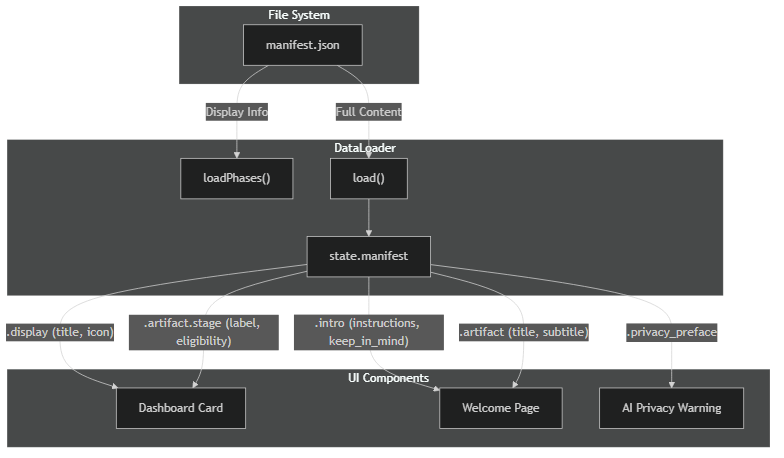
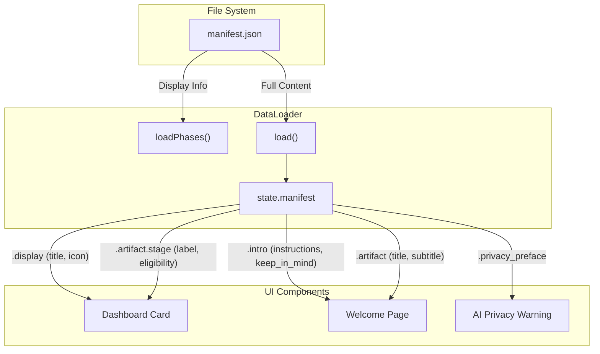

# Manifest Data Flow Waterfall

This document traces how data from `manifest.json` flows from the file system to the user interface.

## 1. Source: Phase Configuration

Each phase directory (e.g., `data/phase_1/`) contains a `manifest.json` file.
Key sections:

- `display`: Metadata for the Dashboard card (title, icon, description).
- `artifact`: Metadata for the active questionnaire (title, subtitle, purpose, stage).
- `intro`: Instructions shown on the Welcome page.
- `prompts_artifact`: Metadata linking to `prompts.json` (ID matching).

## 2. Ingestion: `DataLoader.js`

The `DataLoader` module is the central hub for reading manifest data.

### Loading Process (`loadPhases()`)

1. Reads `data/phase-registry.json` to find active phase folders.
2. Fetches `manifest.json` for *each* registered phase.
3. Extracts the `display` section to build the list of available phases.
4. Stores this list in `DataLoader.phases` for the Dashboard.

### Active Phase Loading (`load()`)

When a user selects a phase:

1. `DataLoader.setCurrentPhase(phaseId)` sets the active context.
2. `DataLoader.load()` fetches the full `manifest.json` (along with questions and prompts).
3. The full manifest is stored in `DataLoader.manifest`.

### Accessors

- `DataLoader.getIntro()`: Returns `manifest.intro`.
- `DataLoader.getArtifact()`: Returns `manifest.artifact`.
- `DataLoader.getDisplay()`: Returns `manifest.display`.
- `DataLoader.getPrivacyPreface()`: Returns `manifest.privacy_preface`.

## 3. Consumption: UI Modules

### A. Dashboard (`dashboard.js`)

*File Path*: `js/app/dashboard.js`
*Consumption*:

- Calls `DataLoader.getPhases()` to render cards.
- **Display Data**: Uses `.display.title`, `.display.icon`, `.display.description` to render the Phase Card.
- **Stage Label**: Uses `.artifact.stage.label` to show "Initial Compatibility", "Defined Relationship", etc.
- **Eligibility/Purpose**: Uses `.artifact.stage.eligibility` or `.artifact.purpose` to populate the "This is for you if..." or "Purpose" sections on the card details.

### B. Welcome View (`views.js`)

*File Path*: `js/app/views.js` -> `renderWelcomeIntro()`
*Consumption*:

- Calls `DataLoader.getIntro()`.
- **Instructions**: Explicitly renders `.intro.instructions.title` and `.intro.instructions.items`.
- **Keep in Mind**: Explicitly renders `.intro.keep_in_mind.title` and `.intro.keep_in_mind.items`.
- **Title/Subtitle**: Calls `DataLoader.getArtifact()` to render `.artifact.title` and `.artifact.subtitle` as the page header.

### C. AI Analysis (`ai-analysis-transparency.js` / logic)

*Consumption*:

- Uses `.prompts_artifact.id` to match with exported data, ensuring the correct prompts are loaded for the correct phase.
- Uses `.privacy_preface` to display privacy warnings before generating content.

## 4. Visual Flow

## Note on Unused Fields

Schema fields such as `when_to_use` or `after_completion` (found in some legacy or extended schemas) are **not** currently rendered by `views.js`. Only `instructions` and `keep_in_mind` are explicitly handled in the Welcome view loop.
