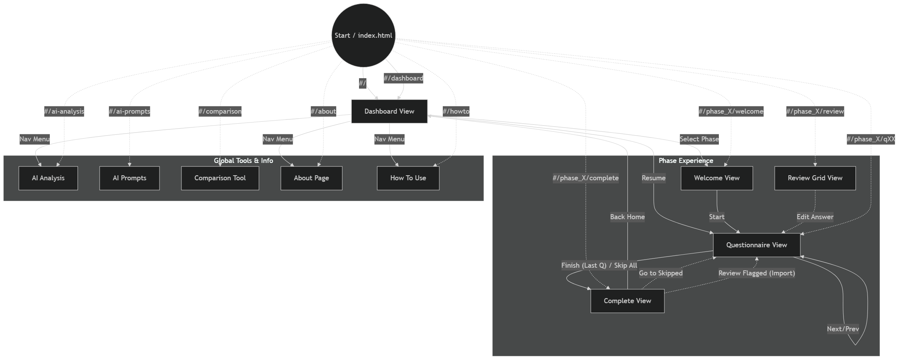

# Web App Architecture & Pathway

This document outlines the routing logic, view transitions, and architectural flow of the Ready for Us web application.

## 1. Core Routing Architecture

The application uses a hash-based router (`js/url-router.js`) to manage state without page reloads.

**Base URL**: `https://readyforus.app/` (or `http://127.0.0.1:8000/`)

| Route Pattern | View Name | Description |
| :--- | :--- | :--- |
| `#/` | **Dashboard** | Main hub for selecting phases. |
| `#/phase_{ID}/welcome` | **Welcome** | Intro page for a specific phase (Start/Resume). |
| `#/phase_{ID}/q{XX}` | **Questionnaire** | Active question view (e.g., `#/phase_1/q05`). |
| `#/phase_{ID}/review` | **Review** | Grid view of answers (accessed via logic/router). |
| `#/phase_{ID}/complete` | **Complete** | Check-in finished screen with stats and export. |
| `#/ai-analysis` | **AI Analysis** | Tool for analyzing relationship data. |
| `#/ai-prompts` | **AI Prompts** | Generator for custom AI prompts. |
| `#/comparison` | **Comparison** | Tool for comparing partner answers. |
| `#/about` | **About** | About the toolkit. |
| `#/howto` | **How To** | Usage instructions. |

## 2. User Experience Flow

### A. The Check-In Loop

1. **Dashboard**: User selects a Phase Card.
2. **Welcome**: Displays `manifest.intro` content. User clicks "Start" or "Continue".
3. **Questionnaire**:
    * **Engine**: `js/questionnaire-engine.js` manages state.
    * **Renderer**: `js/question-renderer.js` builds the UI.
    * **Navigation**: "Next" moves to `q+1`. "Finish" on the last question moves to **Complete**.
4. **Complete**:
    * Displays stats and "Copy Results" actions.
    * Offers "Go to Skipped" if applicable (Redirects to Questionnaire).

### B. Global Tools

* **AI Analysis**: Standalone tool accessible via the Navigation Menu.
* **Import/Export**: Managed by `js/import-manager.js` and `js/export-manager.js`.

## 3. Key File Components

* **Routing**: `js/url-router.js` (Parses URL hash, updates App state).
* **Views**: `js/app/views.js` (Manages DOM visibility and rendering for major views).
* **Navigation**: `js/app/navigation.js` (Handles button clicks, Next/Prev logic, and view transitions).
* **Dashboard**: `js/app/dashboard.js` (Renders the main grid of Phase Cards).
